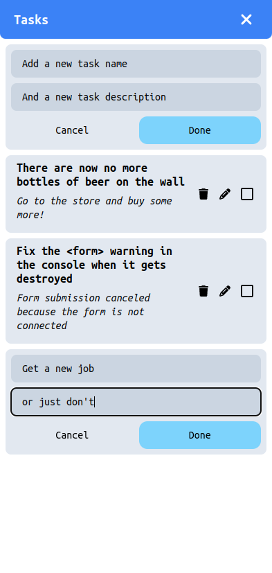

# Svelte 5 todo app (one day build)

A small and simple todo web application made using Sveltekit, Tailwind CSS, and **Svelte 5** in one day.



## Building

```sh

bun install # install dependencies
bun run build # to build
bun run preview # to serve the build
```

## Developing

```sh
bun install
bun run dev
```
